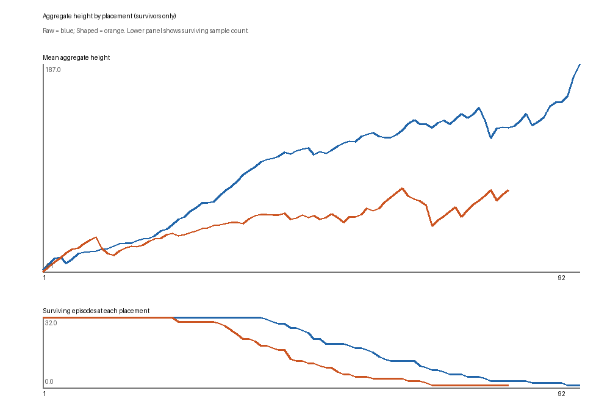
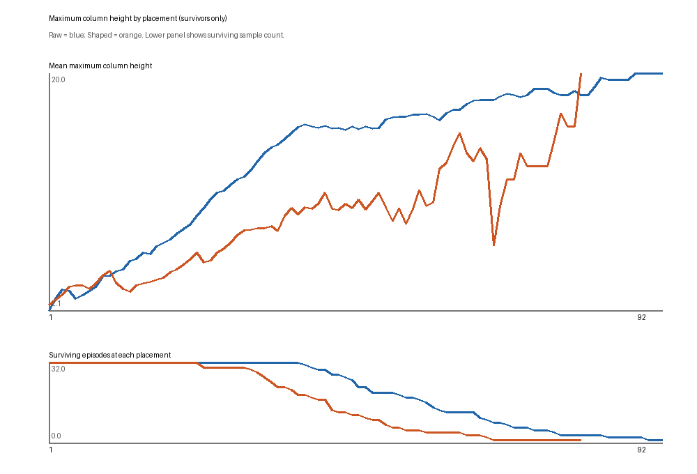
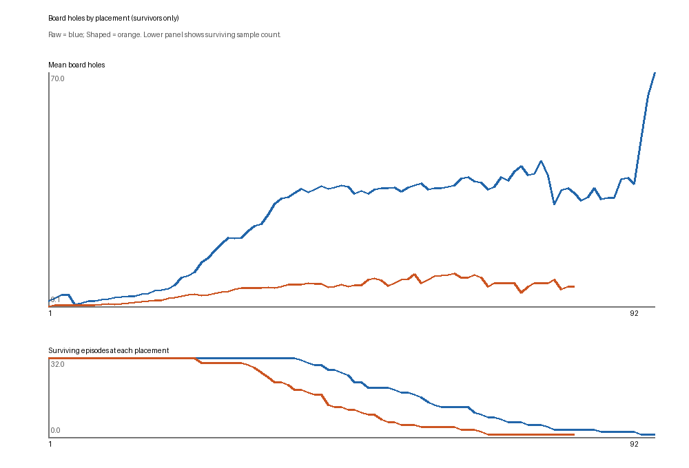
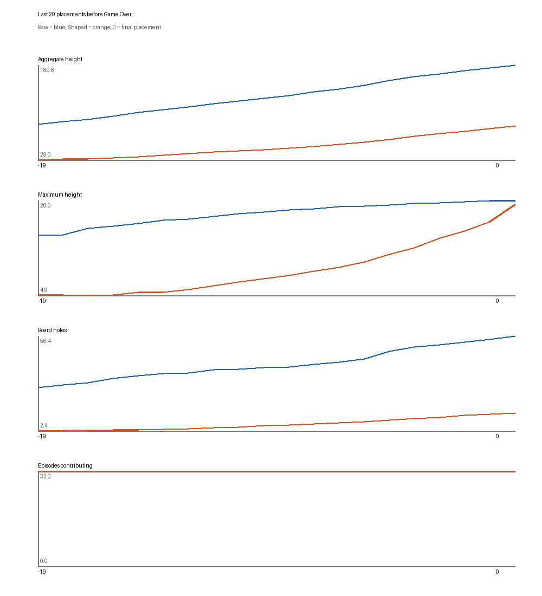
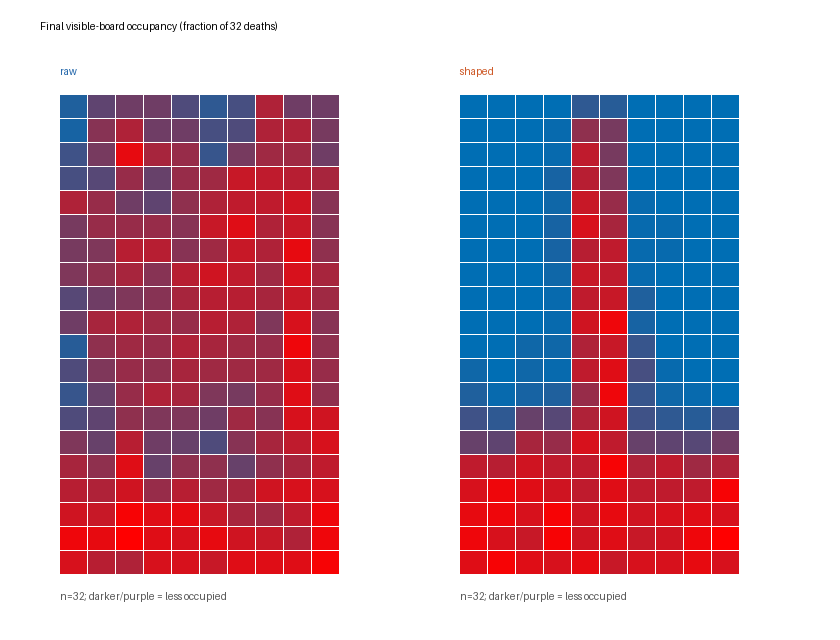

# PPO-Shaped V1 2M 提前死亡诊断

**结论：**Shaped 不是把整块棋盘堆满，而是反复在中央形成狭窄尖塔。它少造洞、消行效率更高，但最高列在很短时间内冲到出生区并结束游戏。数据支持“局部高度风险未被洞惩罚捕捉”，不能证明模型有意快速死亡。

## 可复核口径

使用 Raw `step_002002944` 与 Shaped `final` 两个已完成 checkpoint；SHA-256 分别为 `426935eccace49f248250c2286bbef952b3bde1a7e119dfeea0fff34b7e7cbbc` 与 `66e7dd8efeb11ef8f0e375f0310afb9ee04a709a9915c9ed6ed4538efbdb4bd5`。固定 validation seeds `100000..100031`，每局最多 5,000 块，`deterministic=True` 且每步用官方 Action Mask。只从 TetrisEnv/TetrisCore 的真实落点后棋盘取特征，重放的逐 seed 块数、消行、分数和新增洞总数与先前配对评测全部一致。未读取 final-test seeds，未修改 Core、Reward、模型或事务记录。

逐 seed 的每步动作、当前/落下方块、Hold、消行、前后棋盘特征、完整可见棋盘、得分和 Reward 保存在 `runs/ppo_hole_v1_failure_analysis/{raw,shaped}_seed_*.json`；`summary.json` 与 `curves.json` 保存汇总和每个横坐标的样本数。64 份逐 seed 轨迹另以确定性 gzip 压缩归档到 [ppo_hole_v1_failure_traces](ppo_hole_v1_failure_traces/)，同目录也归档汇总与曲线 JSON；图表与本报告纳入 Git。复算命令：`.venv/bin/python -m analysis.ppo_hole_failure --from-traces`；如需重新执行模型轨迹，用全新输出目录运行 `-m analysis.ppo_hole_failure --output <new-path>`。

## 配对结果与棋盘形状

| 指标 | Raw 2M | Shaped 2M |
| --- | ---: | ---: |
| 平均存活块 | 57.94 | 43.06 |
| 平均消行 / 每 100 块消行 | 10.25 / 17.69 | 10.13 / 23.51 |
| 平均游戏分数 | 1,315.63 | 1,621.88 |
| 每 100 块新增洞 | 151.24 | 36.94 |
| 死亡时总高度 / 最高列 / 洞 | 180.78 / 20.00 / 56.44 | 83.22 / 19.31 / 12.47 |
| 死亡时凹凸度 / covered holes | 14.31 / 319.53 | 33.34 / 64.34 |
| 每步总高度增量 / 最高列增量 | 3.12 / 0.345 | 1.93 / 0.448 |

32 局全部 Game Over，均未触及 5,000 块上限。Shaped 每步总高度增长反而更慢，终局总高度不到 Raw 的一半；但最高列接近棋盘顶，凹凸度约 2.33 倍。死亡棋盘最高手列位于中央第 4/5 列（零起始）**31/32 局**，这两列终局平均高度为 **18.13/17.00**；其余列大多只有约 5–7 行。Raw 的终局列高普遍为约 15–19，最高手列分散。Shaped 在最后一个动作之前最高列平均 16.63，最后一步后 19.31；低洞数与危险的局部尖塔同时存在。Shaped 32 局的终步棋盘均发生变化，结合 Core 的 Top Out 分支，说明它们是合并后新块出生碰撞（Block Out），而非整块位于顶部以上的 Lock Out。

| 首次达到最高列 | Raw 平均块号 / 后续到死亡 | Shaped 平均块号 / 后续到死亡 |
| --- | ---: | ---: |
| 15 | 34.25 / 23.69 块 | 40.31 / 2.75 块 |
| 18 | 41.47 / 16.47 块 | 42.75 / 0.31 块 |
| 19 | 44.47 / 13.47 块 | 42.88 / 0.19 块 |

全部 32 局都达到这三个阈值。Shaped 到达 15 行比 Raw 更晚，但随后迅速顶出；Raw 则能在高棋盘状态继续十多块。死亡前 20 步，Raw 平均总高度 **85.56→180.78**、最高列 **14.44→20.00**、洞 **26.81→56.44**；Shaped 分别为 **28.97→83.22**、**4.97→19.31**、**2.41→12.47**。图中的死亡前相对位置均有 32 局；普通块号曲线只对当时仍存活的 episode 求平均，下方显示每点样本数，尾部少数幸存局不宜过度解释。

## 动作与 Reward

| 动作指标 | Raw | Shaped |
| --- | ---: | ---: |
| Hold 使用率 | 37.0% | 42.7% |
| 单消 / 双消 / 三消 / 四消次数 | 304 / 12 / 0 / 0 | 160 / 36 / 8 / 17 |
| 不新增洞的动作比例 | 57.8% | 74.2% |
| 不新增洞但总高度增加的动作比例 | 37.2% | 60.0% |
| 最高列≥15 时，不造洞但总高度增加 | 33.1%（685 步） | 58.0%（88 步） |
| 最高列≥15 时，落点最左列为 4 | 10.9% | 38.6% |

Shaped 更频繁选择“眼前不造洞、但继续占用上方空间”的落点，高风险状态下尤其集中于中央。这与终局尖塔一致，但观察性轨迹不能证明某个单独落点是唯一死因。Shaped 的四消 17 次而 Raw 为 0，说明它并非完全不消行或不敢放置；每 100 块消行效率也更高。

每局累计 Raw Reward 均值：Raw 轨迹 **8.68**、Shaped 轨迹 **11.92**。按 `λ=0.10` 回算洞惩罚分别为 **8.76** 与 **1.59**，对应的 Shaped Reward 分别约 **−0.08**（Raw 轨迹的反事实计算）和 **10.33**（Shaped 实际训练 Reward）。此反事实只对已发生的轨迹算分，不能推断 Raw 策略在新 Reward 下会如何训练。Shaped 的更短寿命、较少未来洞惩罚符合快速死亡漏洞的表象；但它同时获得更高 Raw Reward、更多高价值消行，且死亡时局部高度已接近 20。当前证据更直接支持**洞惩罚诱导局部堆高**，不足以声称“有意自杀”。

## 下一实验优先级

1. **先将 λ 降至 0.02 做同协议受控对照。** 0.10 每新增一洞扣 0.1，是每步存活奖励 0.001 的 100 倍；当前明显压低洞却损害寿命。只改系数能检验强度是否过高，并保持最清楚的因果比较。
2. **若仍出现尖塔，设计正确终止处理的状态势函数 Shaping。** 让高度/洞风险以可检验的势差进入 Reward，避免简单逐步惩罚对长局累计不利；实现前需核对折扣和终止项。
3. **再考虑最高列增量或顶部风险惩罚。** 单纯总高度变化惩罚可能漏掉本次观察到的中央尖塔；若做高度实验，应针对最高列和出生区风险，独立检验副作用。
4. **最后考虑候选落点特征与网络结构。** 当前 237 维棋盘 Observation 已包含尖塔信息，先检验 Reward 信号比同时改网络更容易解释。

本任务没有启动新训练；上述顺序是建议，不是已验证的性能结论。
